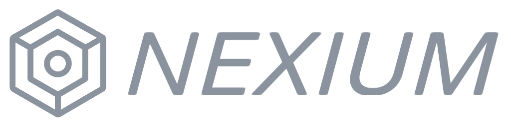
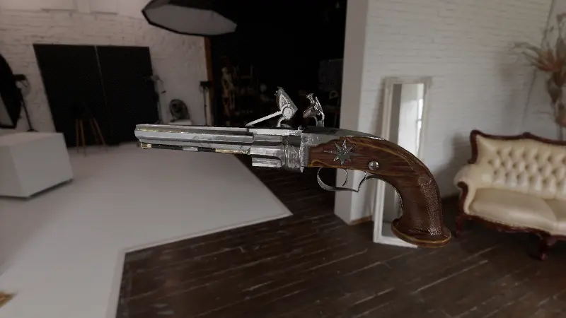

<p align="center">
  
  <br>
  
</p>

**Hyperion** is a C library inspired by [raylib](https://www.raylib.com/), but focused on advanced 3D rendering. If you enjoy raylib’s simplicity but are looking for a modern all-in-one 3D framework, Hyperion is for you.

> ⚠️ Hyperion is in active development and not yet stable.

## Features (so far)

### 3D Rendering

* **Shading**: full PBR (Burley/Schlick GGX) with roughness, metalness, occlusion, normal and emission maps.
* **Materials** texture scale/offset, alpha cutoff, cull and blend modes.
* **Lighting**: forward clustered lighting and [EVSM](https://martincap.io/projects/evsm/) shadows (with [VSM](https://pierremezieres.github.io/site-co-master/references/vsm_paper.pdf) fallback for OpenGL ES 3.2)
* **Environment**: cubemaps for skyboxes and basic reflection probes
* **Post-processing**: color adjustment, debanding, tonemapping (Reinhard, Filmic, ACES, AgX)

### 3D Models

* **Meshes**: cube, sphere, cylinder, cone, capsule
* **Import**: Assimp for 3D model and material loading
* **Animations**: rigged models, custom pose arrays for blending

### 2D Rendering

* **Primitives**: lines, triangles, quads, rectangles, circles, arcs, rings, rounded rectangles, etc.
* **Textures**: can be applied to all shapes
* **Custom shapes**: support for primitive lists, strips, fans, loops
* **Text rendering**: bitmap and SDF

### Audio

* **Playback**: clips and streams, async decoding
* **Multiple instances**: same clip can play simultaneously

### Math

* **Helpers**: wrapping, remap, angles, easings, common conversions/interpolations
* **Vectors**: 2D, 3D, 4D with add, subtract, scalar multiply, dot/cross product, lerp, etc.
* **Quaternions**: conversion to/from matrices and vectors, slerp, helpers, etc.
* **Matrices**: 3x3 and 4x4 for transformations, rotations, scaling, projections
* **Color**: manipulation and conversion (RGB/HSV), interpolation
* **Transforms**: 3D struct with translation, rotation, scale

## Roadmap (before first release)

Here’s a checklist of the major features that are still missing:

- [x] Instanced rendering
- [ ] Unshaded rendering mode
- [x] Rendering to custom render targets
- [x] Procedural skybox cubemap generation
- [ ] Dynamic reflection probes
- [x] Screen space ambient occlusion
- [x] Bloom in post process
- [x] Fog effect
- [ ] Custom post-processing shaders
- [x] Custom material shaders
- [ ] More flexible 2D rendering
- [ ] Audio spatialization

## Getting Started

### Requirements
First, to run Hyperion you’ll need a GPU with **OpenGL 4.5** or **OpenGL ES 3.2** support.

To build the project, make sure you have:
- A C11/C++23 compiler
- CMake 3.20+
- Python 3.6+

### Dependencies
Hyperion depends on: [SDL3](https://github.com/libsdl-org/SDL), [PhysFS](https://github.com/icculus/physfs), [Freetype](https://github.com/freetype/freetype) and [Assimp](https://github.com/assimp/assimp)

You can either install these manually, or clone Hyperion with submodules:
```bash
git clone --recurse-submodules https://github.com/Bigfoot71/Hyperion.git
````

If you already cloned without submodules:

```bash
git submodule update --init --recursive
```

### Building

When configuring with CMake, enable vendored dependencies for any library not installed on your system:

```bash
cmake -DHP_SDL3_VENDORED=ON \
      -DHP_PHYSFS_VENDORED=ON \
      -DHP_FREETYPE_VENDORED=ON \
      -DHP_ASSIMP_VENDORED=ON \
      -B build
cmake --build build
```

### Documentation

You can also generate the Doxygen documentation while building the project by enabling it in CMake:
```bash
cmake -DHP_BUILD_DOCS=ON -B build
cmake --build build --target docs
```

## Contributing

Hyperion is actively being developed. Pull requests, feedback, and bug reports are very welcome!

## Dependencies

Thanks to the amazing open source projects that power Hyperion:
  - [Assimp](https://assimp.org/)
  - [dr_libs](https://github.com/mackron/dr_libs)
  - [FP16](https://github.com/Maratyszcza/FP16)
  - [freetype](https://freetype.org/)
  - [glad](https://gen.glad.sh/)
  - [mojoAL](https://icculus.org/mojoAL/)
  - [PhysFS](https://icculus.org/physfs/)
  - [SDL](https://www.libsdl.org/)
  - [stb](https://github.com/nothings/stb)

# Examples




## License

Licensed under the **Zlib License** - see [LICENSE](LICENSE) for details.
